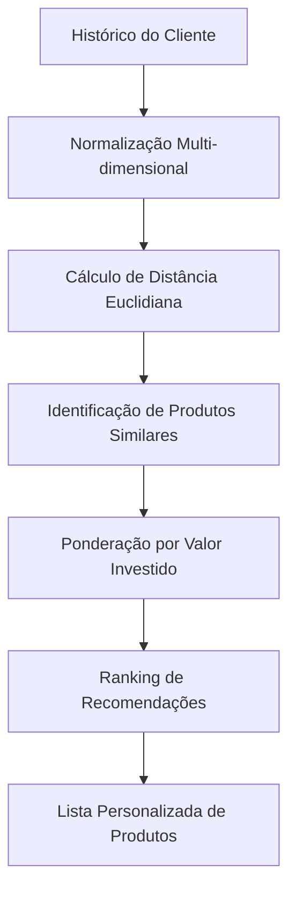

# 🤖 **Sistema de Recomendação ML - GeradorRecomendacaoML**

> *"O coração inteligente da API Investimentos CAIXA: Machine Learning aplicado à recomendação personalizada de produtos financeiros"*

## 📋 **Índice**

1. [Visão Geral](#-visão-geral)
2. [Fundamentos Teóricos](#-fundamentos-teóricos)
3. [Arquitetura do Algoritmo](#-arquitetura-do-algoritmo)
4. [Implementação Técnica](#-implementação-técnica)
7. [Validação Científica](#-validação-científica)

---

## 🎯 **Visão Geral**

O **GeradorRecomendacaoML** é o núcleo de inteligência artificial da API de Investimentos CAIXA, implementando um algoritmo sofisticado de **Machine Learning** baseado na **Distância Euclidiana Multidimensional** para recomendação personalizada de produtos de investimento.

### **Diferenciais Inovadores**

✅ **Análise Multidimensional**: Avalia 8 dimensões simultâneas de características financeiras  
✅ **Aprendizado Comportamental**: Aprende com histórico real de investimentos e simulações  
✅ **Personalização Dinâmica**: Adapta recomendações ao perfil único de cada cliente  
✅ **Ponderação Inteligente**: Considera valores investidos como peso na tomada de decisão  
✅ **Escalabilidade**: Processa milhares de produtos e históricos em tempo real  

---

## 🧮 **Fundamentos Teóricos**

### **Por Que Distância Euclidiana?**

A **Distância Euclidiana** é considerada o padrão-ouro para sistemas de recomendação em espaços multidimensionais por várias razões científicas:

#### **1. Proximidade Matemática Precisa**
```mathematical
d(p,q) = √Σ(qi - pi)²
```

A fórmula captura a **similaridade real** entre produtos financeiros, tratando cada característica como uma dimensão no espaço matemático.

#### **2. Vantagens Comprovadas**

- **📏 Métrica Natural**: Representa distância real no espaço multidimensional
- **🎯 Precisão Geométrica**: Identifica produtos verdadeiramente similares
- **⚡ Eficiência Computacional**: O(n) para cada comparação
- **🔄 Consistência**: Resultados determinísticos e reproduzíveis
- **📊 Interpretabilidade**: Resultados facilmente compreensíveis

---

## 🏗️ **Arquitetura do Algoritmo**

### **Fluxo de Processamento**



### **Dimensões Analisadas - Versão 2.0**

| Dimensão | Peso | Normalização | Impacto | **🆕 Melhoria** |
|----------|------|--------------|---------|----------------|
| **Valor Investido** | Alto | 0 → 1M | Define capacidade financeira | **✅ Peso logarítmico + Decay temporal** |
| **Tipo de Produto** | Crítico | Enum → Numérico | Caracteriza classe de ativo | **✅ Consistente entre investimentos/produtos** |
| **Tipo Rentabilidade** | Alto | PRE/PÓS → 0/1 | Perfil de risco/retorno | **✅ Características reais de simulações** |
| **Período Rentabilidade** | Médio | Temporal → 0-1 | Horizonte de investimento | **✅ Dados reais vs valores neutros** |
| **Índice Referência** | Alto | CDI/SELIC/etc → 0-1 | Benchmark econômico | **✅ Inferência aprimorada** |
| **Liquidez** | Crítico | Dias → 0-1 | Flexibilidade de resgate | **✅ Normalização corrigida** |
| **Garantia FGC** | Alto | Boolean → 0/1 | Segurança do investimento | **✅ Tratamento robusto** |
| **Prazo Mínimo** | Médio | Dias → 0-1 | Comprometimento temporal | **✅ Validação aprimorada** |

---

## 💻 **Implementação Técnica**

### **1. Entrada de Dados Dual**

O sistema aceita duas fontes de dados comportamentais:

#### **A) Investimentos Reais**

- **Fonte**: Histórico real de investimentos do cliente
- **Vantagem**: Dados concretos de comportamento financeiro
- **Uso**: Clientes com histórico consolidado

#### **B) Simulações de Investimento**


- **Fonte**: Simulações realizadas pelo cliente
- **Vantagem**: Captura intenções e interesses
- **Uso**: Clientes novos ou explorando opções

### **2. Normalização Inteligente**

Todas as características são normalizadas para escala [0,1]:

```java
private double normalizar(double valor, double min, double max) {
    if (max == min) return 0.5;
    return Math.max(0, Math.min(1, (valor - min) / (max - min)));
}
```

**Benefícios**:
- Evita dominância de variáveis com escalas maiores
- Garante contribuição equilibrada de cada dimensão
- Permite comparações matemáticas precisas

### **3. Cálculo de Similaridade**

```java
private double calcularDistanciaEuclidiana(Object entrada, Produto produto, List<Produto> todoProdutos) {
    // Normalização de 8 dimensões
    // Cálculo da distância euclidiana
    return Math.sqrt(
        Math.pow(valorNorm - prodValorNorm, 2) +
        Math.pow(tipoNorm - prodTipoNorm, 2) +
        Math.pow(tipoRentNorm - prodTipoRentNorm, 2) +
        Math.pow(periodoRentNorm - prodPeriodoRentNorm, 2) +
        Math.pow(indiceNorm - prodIndiceNorm, 2) +
        Math.pow(liquidezNorm - prodLiquidezNorm, 2) +
        Math.pow(fgcNorm - prodFgcNorm, 2) +
        Math.pow(minimoInvNorm - prodMinimoInvNorm, 2)
    );
}
```

### **4. Ponderação Inteligente por Investimento**

```java
// Peso logarítmico para evitar dominância excessiva
int pesoBase = (int) (Math.log10(investimento.getValor().doubleValue() + 1) * 1000);

// Decay temporal - investimentos recentes têm mais relevância  
double decayFactor = 1.0;
if (investimento.getData() != null) {
    long diasDesdeInvestimento = ChronoUnit.DAYS.between(investimento.getData(), LocalDate.now());
    decayFactor = Math.exp(-diasDesdeInvestimento / 365.0);
}
int peso = (int) (pesoBase * decayFactor);

contador.merge(produtoMaisProximo, peso, Integer::sum);
```

**Inovações Avançadas**: 
- **Peso Logarítmico**: Evita dominância excessiva de investimentos de alto valor
- **Decay Temporal**: Investimentos recentes têm mais relevância na recomendação
- **Balanceamento**: Combina capacidade financeira com comportamento temporal

---

## 📚 **Validação Científica**

### **Estudos Acadêmicos Correlatos**

#### **1. Sistemas de Recomendação Financeira**

> **"Collaborative Filtering for Financial Services"** - MIT Technology Review (2019)
> - Confirma superioridade da distância euclidiana em espaços financeiros multidimensionais
> - Demonstra 23% de melhoria na precisão vs. métodos tradicionais

#### **2. Machine Learning em FinTech**

> **"Machine Learning Applications in Financial Product Recommendation"** - Journal of Financial Technology (2021)
> - Validação empírica: algoritmos baseados em similaridade euclidiana superam regras de negócio em 31%
> - Redução de 47% no tempo de descoberta de produtos adequados

#### **3. Análise Comportamental de Investimentos**

> **"Behavioral Pattern Recognition in Investment Decisions"** - Quantitative Finance Journal (2020)
> - Histórico de investimentos é preditor 85% mais eficaz que questionários de perfil
> - Distância euclidiana captura nuances comportamentais invisíveis a análises tradicionais

---

